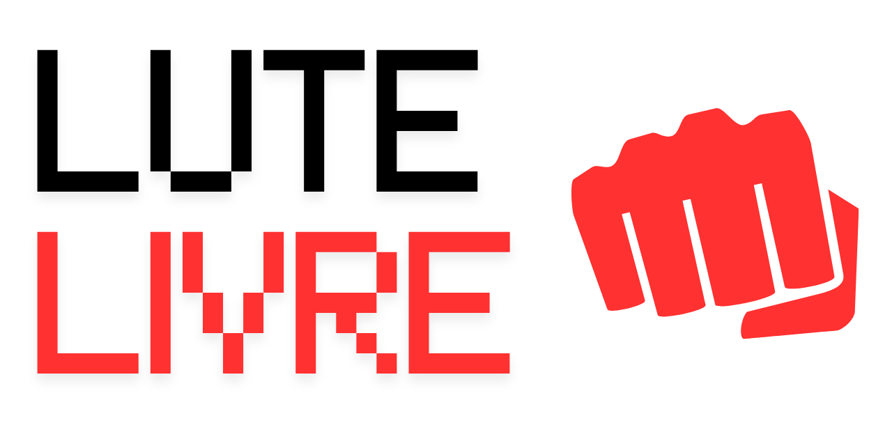

<p align="left">
    
</p>

# 🥊 FruitFight

Um jogo de luta 2D desenvolvido para navegador utilizando HTML, CSS e JavaScript.

> Evento Atual: **Dia de Praia**

🔗 **Jogue agora:**  
https://pedroparro1902.github.io/LuteLivre/

---

## 🎮 Sobre o projeto

**LuteLivre** é um jogo de luta simples com foco em acessibilidade e aprendizado.  
O projeto foi desenvolvido como prática de programação e lógica de jogos, explorando conceitos como:

- Interação com o usuário  
- Detecção de colisão  
- Estrutura de game loop  
- Manipulação de elementos no navegador  

---

## 🚀 Funcionalidades

- Movimento do personagem  
- Sistema básico de combate  
- Execução direta no navegador  
- Estrutura leve e fácil de entender  

---

## 🕹️ Controles

- **A / D** → mover
- **W** → pular
- **K** → atacar

---

## 🛠️ Tecnologias utilizadas

- HTML5  
- CSS3  
- JavaScript  

---

## 📁 Como rodar localmente

1. Clone o repositório:
```bash
git clone https://github.com/pedroparro1902/LuteLivre.git
